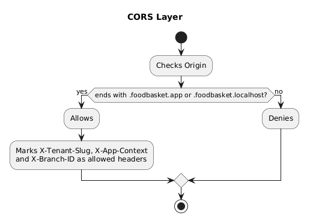
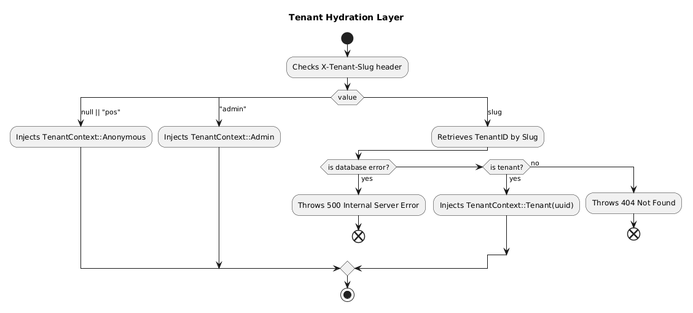
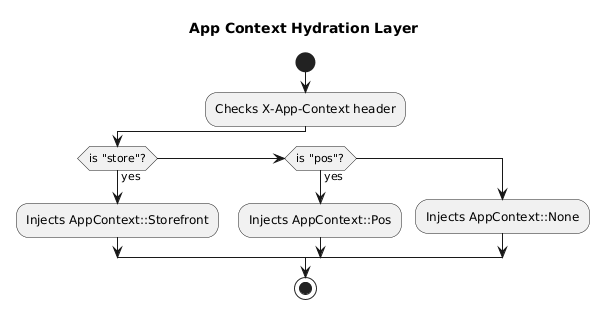
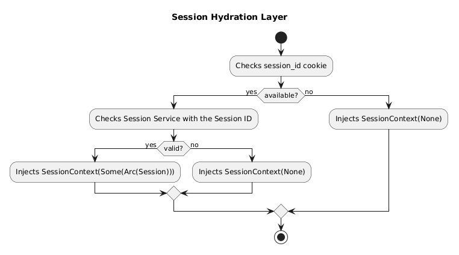
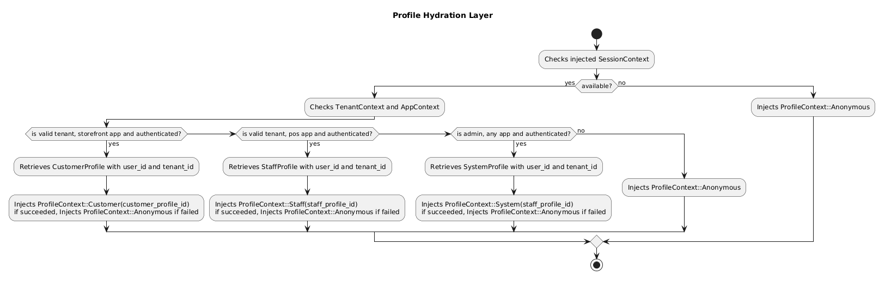
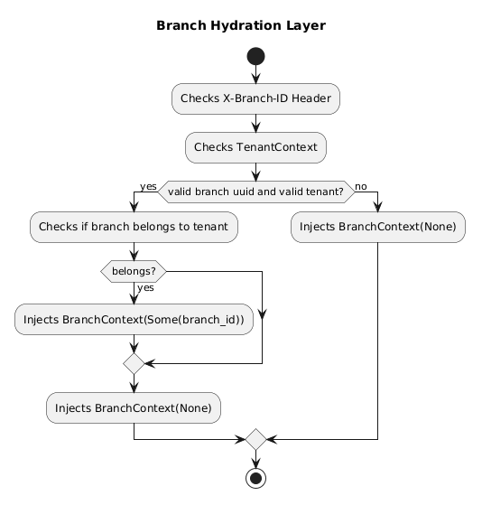
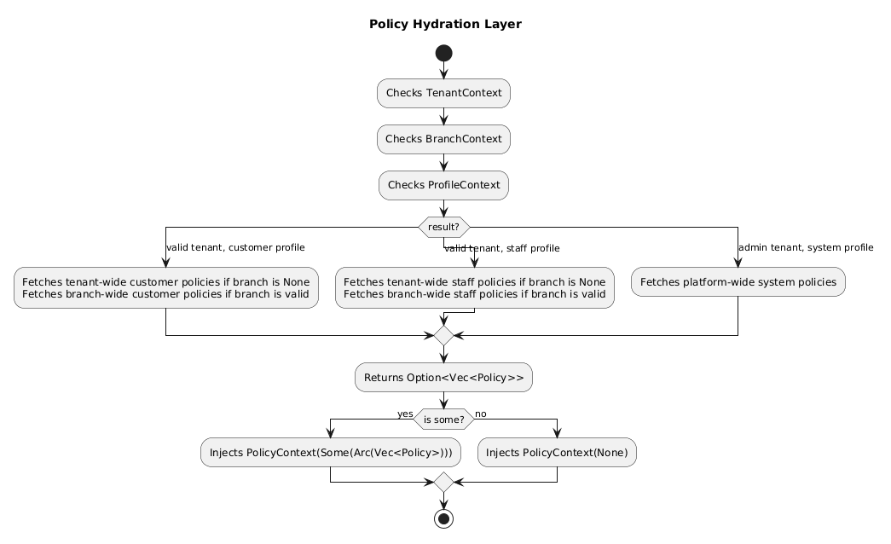

# ES03 - Host, Tenant and Session Hydration

## Revisions History

| Version |    Date    | Changelog                                           |
| :-----: | :--------: | --------------------------------------------------- |
|   2.1   | 2026-03-15 | Updates the pipeline to not use Origin header.      |
|   2.0   | 2026-03-05 | Changes the architecture from Go Echo to Rust Axum. |
|   1.0   | 2026-02-03 | Initial version.                                    |

## Summary

This document outlines the process of 'hydrating' a handler's context throughout
the pipeline of Axum routing.

## Rationale

This process is done to provide the best level of isolation, without having to burden
the client or the API users with a lot of query parameters, as most of them should
be done via a browser. This logic may be changed later, but the logic of injecting
them into handlers would not change.

## The Pipeline

When a request hits the backend, it goes from these layers from layer 1 as the
outermost layer and goes inwards. When the response comes out, it goes the opposite
direction from layer N downwards to layer 1. This is how middlewares work, but
for this project so far, most of these layers only serve as a gatekeeper and checking
for various information in the request.

There are a total of 4 authentication layers (or if you can call it that):

- Session: Dictates who the user is (Identity). Specified in a Cookie named `session_id`.
- Tenant Scope: Dictates the scope the user is in (Where). Specified in a Header
  named `X-Tenant-Slug`. This specifies the slug of the tenant, such as `twinbells.foodbasket.app`
  would mean the tenant's slug would be `twinbells`.
- Branch Scope: Dictates which branch the user is in (Where). Specified in a Header
  named `X-Branch-ID`. This specifies a valid UUID of a branch for a tenant.
- App Context: Dictates how the application should work (What). Specified in a Header
  named `X-App-Context`. This specifies what type of Persona to fetch for the current
  user.

For more details on each header or cookie, read the corresponding layer. All diagrams
are done in PlantUML by me, and a descriptive description written by Gemini.

### Layer 1: Cross-Origin Resource Sharing

1. **Start**: The process begins when a request hits the CORS layer.
2. **Origin Check**: The system extracts the `Origin` header from the request.
3. **Domain Validation**: A conditional check determines if the origin ends with
   `.foodbasket.app` or `.foodbasket.localhost`.
4. **Authorized Path (Success)**:
   - The origin is **Allowed**.
   - The system white-lists the following custom headers for the request:
     - `X-Tenant-Slug`
     - `X-App-Context`
     - `X-Branch-ID`
5. **Unauthorized Path (Failure)**:
   - If the origin does not match the required domains, the request is **Denied**.
6. **End**: The validation process concludes.

### Layer 2: Tenant Hydration

1. **Start**: The process begins by checking the `X-Tenant-Slug` header in the request.
2. **Value Branching**: The system evaluates the value of the header:
   - **If null or "pos"**: It injects `TenantContext::Anonymous`.
   - **If "admin"**: It injects `TenantContext::Admin`.
   - **If a specific slug**: It attempts to **Retrieve TenantID by Slug** from
     the database.
3. **Slug Retrieval Validation**:
   - **Database Error**: If a database error occurs, it **Throws 500 Internal
     Server Error** and terminates.
   - **Tenant Found**: If a valid tenant is found, it injects `TenantContext::Tenant(uuid)`.
   - **Tenant Not Found**: If no tenant matches the slug, it **Throws 404 Not
     Found** and terminates.
4. **End**: Successful paths converge and the hydration process completes.

### Layer 3: App Context Hydration

1. **Start**: The process begins by inspecting the `X-App-Context` header.
2. **Context Check**: The system evaluates the header value against specific keywords:
   - **If "store"**: It injects `AppContext::Storefront`.
   - **If "pos"**: It injects `AppContext::Pos`.
   - **If neither**: It defaults to injecting `AppContext::None`.
3. **End**: The appropriate context is applied, and the process completes.

### Layer 4: Session Hydration

1. **Start**: The process begins by checking for the presence of a `session_id`
   cookie.
2. **Cookie Availability**:
   - **If not available**: It injects `SessionContext(None)` and proceeds to the
     end.
   - **If available**: The system moves to the validation phase.
3. **Session Validation**:
   - The system **Checks Session Service with the Session ID** to verify its status.
   - **If Valid**: It injects `SessionContext(Some(Arc(Session)))`, providing
     active session data.
   - **If Not Valid**: It injects `SessionContext(None)`.
4. **End**: All logical branches converge, and the session hydration is complete.

### Layer 5: Profile Hydration

1. **Start**: The process begins by checking the previously injected **SessionContext**.
2. **Initial Session Check**:
   - **If not available**: The system injects `ProfileContext::Anonymous` and terminates.
   - **If available**: The system proceeds to check **TenantContext** and **AppContext**.
3. **Authentication & Role Branching**: The system evaluates three specific scenarios:
   - **Customer Path**: If it is a valid tenant, storefront app, and authenticated:
     - Retrieves `CustomerProfile` using `user_id` and `tenant_id`.
     - Injects `ProfileContext::Customer` (or `Anonymous` if retrieval fails).
   - **Staff Path**: If it is a valid tenant, POS app, and authenticated:
     - Retrieves `StaffProfile` using `user_id` and `tenant_id`.
     - Injects `ProfileContext::Staff` (or `Anonymous` if retrieval fails).
   - **Admin Path**: If it is an admin, any app, and authenticated:
     - Retrieves `SystemProfile` using `user_id` and `tenant_id`.
     - Injects `ProfileContext::System` (or `Anonymous` if retrieval fails).
4. **Fallback**: If none of the above conditions are met (the "no" path from the
   admin check), it defaults to injecting `ProfileContext::Anonymous`.
5. **End**: All paths converge to complete the profile hydration.

### Layer 6: Branch Hydration

1. **Start**: The process begins by inspecting the `X-Branch-ID` header and the
   current **TenantContext**.
2. **Initial Validation**: The system checks if the request contains a valid
   branch UUID and a valid tenant.
   - **If No**: It injects `BranchContext(None)` and proceeds to the end.
   - **If Yes**: The system moves to ownership verification.
3. **Ownership Check**: The system verifies if the specified branch actually
   **belongs to the tenant**.
   - **If it belongs**: It injects `BranchContext(Some(branch_id))`.
   - **If it does not belong**: The process flows through a merge point to a fallback.
4. **Fallback Injection**: Following the "no" path from the ownership check (or
   after the successful injection logic completes), the flow ensures a
   `BranchContext(None)` state is applied if the specific ID wasn't successfully
   attached.
5. **End**: All branches converge, and the hydration process concludes.

### Layer 7: Policy Hydration

1. **Start**: The process begins by reviewing three existing contexts: **TenantContext**,
   **BranchContext**, and **ProfileContext**.
2. **Contextual Branching**: The system determines which policies to fetch based
   on the combination of these contexts:
   - **Customer Path (Valid Tenant + Customer Profile)**:
     - Fetches **tenant-wide customer policies** if the Branch is `None`.
     - Fetches **branch-wide customer policies** if the Branch is valid.
   - **Staff Path (Valid Tenant + Staff Profile)**:
     - Fetches **tenant-wide staff policies** if the Branch is `None`.
     - Fetches **branch-wide staff policies** if the Branch is valid.
   - **System Path (Admin Tenant + System Profile)**: - Fetches **platform-wide
     system policies**.
3. **Collection**: The system aggregates the results into an `Option<Vec<Policy>>`.
4. **Final Injection**:
   - **If Some**: If policies were found, it injects `PolicyContext(Some(Arc(Vec<Policy>)))`.
   - **If None**: If no policies were found, it injects `PolicyContext(None)`.
5. **End**: The hydration process for the request policy concludes.

### Layer 8: Request Solidify

- Wraps an `Arc` over a `RequestContext` (which contains a cloned object of all
  the previous contexts) and injects it.
