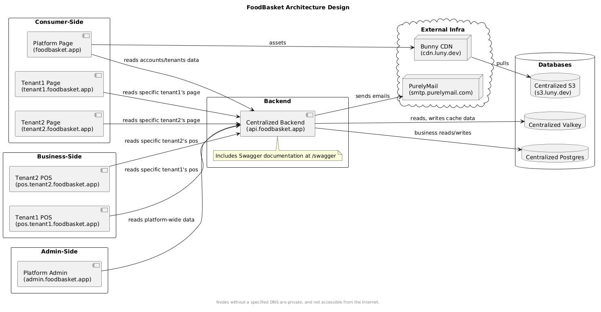

# ES04 - Architecture Design

## Revisions

No changes yet.

- Initial version: `v1`
  - Released on January 3, 2026.

## Summary

This document outlines the architecture design of the FoodBasket platform. This
should show a high-level logical overview and some simple user flows on how a
request hits both ends.

## Architecture Design

Includes the following components, truncated `tenant2` for short:

- **Home Platform**: `foodbasket.app`. This provides the landing page to advertise
  the software, our visions and such things for a SaaS. Also includes simple
  SSO across the platform here to easily navigate to each tenant's storefront,
  included as a way for consumers to order from.
- **Tenant's Platform**: `tenant.foodbasket.app`. This is the hosted landing
  page of the restaurant registered with the service. This provides customization
  over brand identity like colors, fonts, and how to display the menus.
- **Tenant's POS System**: `pos.tenant.foodbasket.app`. Provided as a separate
  system than the landing page to optimize for PWA-like architecture, as well
  as isolation between a work-user and a normal user.
- **The Platform-wide Admin System**: `admin.foodbasket.app`. Allows managing
  all tenants.

Other fluffs such as CDN, S3 service are out of scope for this document and will
not be detailed.
